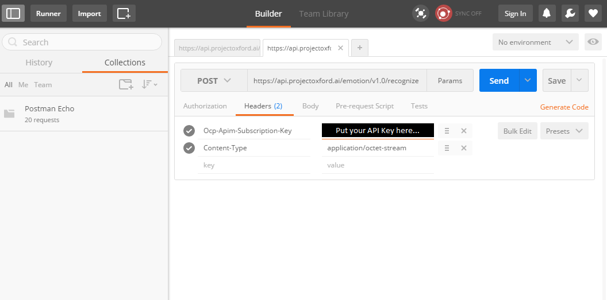
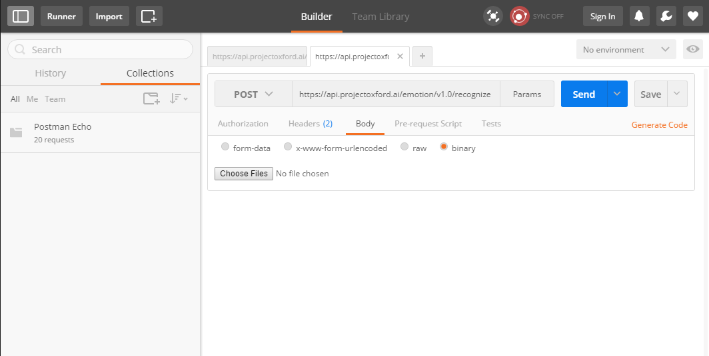
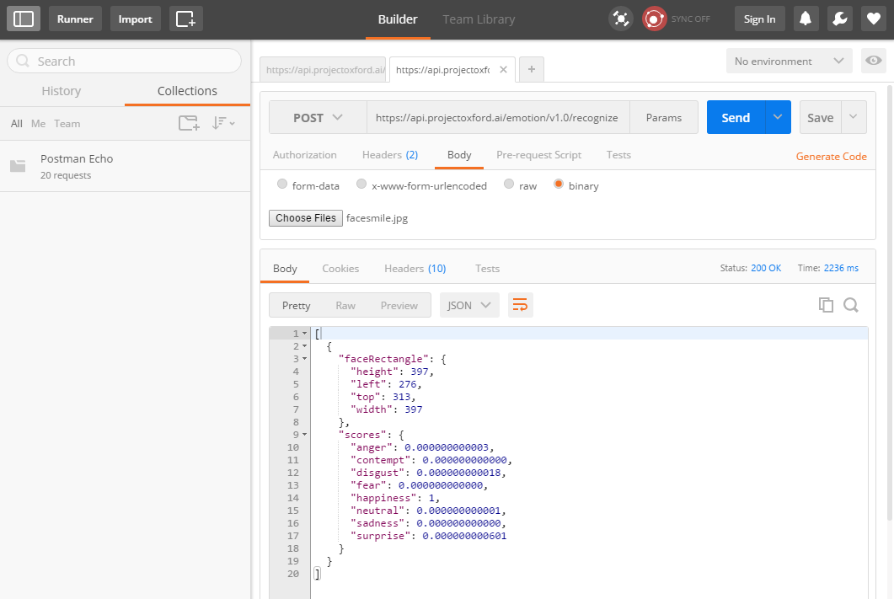

# 4. REST APIs
## Introduction
APIs are the cornerstone for many applications today. They essentially enable an easy way for applications to talk to one another allowing an exchange of data between them. In particular Web APIs (or Web Service APIs) allow websites* to load dynamic content which can better serve the people who use it.

For this tutorial we will be using the Microsoft Cognitive Services Emotion API to determine the emotion of an uploaded photo of a face. Checkout the slides before following the steps below if you aren't too confident with API use.

<sub><sup>*or really any other application</sup></sub>

### API
Application Programming Interface. Basically a set of rules which allow one application to interact with another application. 

### REST APIs
REST(Representation State Transfer) is an architectural style, which when followed allows the API to be lightweight and easily understandable. It commonly uses HTTP for communication, utilising HTTP methods such as POST, GET, PUT, and DELETE. The API response is normally in the form of XML or JSON. 

### XML
eXtensible Markup Language. Set of rules for encoding documents in a format which is readable by both humans and machines. Uses tags, much like in HTML.

### JSON
JavaScript Object Notation. Also another set of rules, however uses JavaScript syntax. JSON is simpler and more compact than XML, and is more commonly used.

### AJAX
Asynchronous JavaScript and XML. Allows webpages to dynamically request data (and subsequently update the web page)  without reloading the entire page. We will be using this to send our API requests.

## Learning Outcomes
- Understand what Web APIs are and how they work
- Learn the "control flow" of an API
- Become familiar with JSON and XML syntax
- Call an API through AJAX
- Understand how to debug APIs


## Bootcamp Resources
- Slide Deck: [Download](https://1drv.ms/p/s!AhUTdgNym7JMjCi5O9hj-jo43KRv)

## Before you Code!
Before we begin even coding, its a good idea to check out the API documentation and sign-up for the service if authentication is required by the API.

Its also a good idea to test out the API through an API tester such as [Postman](https://chrome.google.com/webstore/detail/postman/fhbjgbiflinjbdggehcddcbncdddomop?hl=en). By doing this we can ensure the authentication/API key works (if any) and we can view the formating of the response, which will help when using the response in your web app.

After opening, add the API URL and ensure you are using the correct HTTP method. In this case the API documentation requires POST for the request. Here we have also added the headers. Note in the headers sections, there are "Key" and "Value" text boxes. You need to ensure your words in the Key text box correspond exactly how the API specifies, otherwise it wont work. Referring to the picture, add in your own API key where the black box is.



We also need to add in the photo itself! We do this in the "body" section. You will see many radio buttons for different data types. Files are also referred to binaries. So select that and add in your test photo.



After sending the request, you should be provided with a response. If there is an error it will likely provide an error message. In our case the request worked! Here you can see what the API responded with and what type of data it was. We can now refer to this when structuring how to store/use these values when we send our request through ajax.




## Set-Up: External Logic 
*This tutorial assumes completion of prior modules. There are a few bits of external logic which are used to support the API result and file checking. They will be covered briefly here.* 
*This code is really only for use with the Emotion API and wouldn't necessarily be applicable for other APIs*

*If you just want to know how to send a request through Ajax, you can skip this part and head to the API Call section!*

*This includes:* 

*- Checking uploaded photo file for correct file (ie png, jpg, etc)*

*- Setting up Emojis to correspond to the particular mood.*

*- Setting up thresholds to determine the specific emotion boundaries.*

####1. DOM Object Use 

We have referenced DOM objects with jQuery. However through this it returns jQuery Objects, which we cant directly use when trying to manipulate them. To use them we need to refer to the first item [0] of the jQuery object which holds the DOM Object. See below.

```JavaScript

var pageheader = $("#page-header")[0]; //note the [0], jQuery returns an object, so to get the html DOM object we need the first item in the object
var pagecontainer = $("#page-container")[0]; 
var imgSelector = $("#my-file-selector"); //You dont have to use [0], however this just means whenever you use the object you need to refer to it with [0].
var refreshbtn = $("#refreshbtn"); 

//Note: changing them all to [0] may prevent some errors when using functions linked to that variable.
```

####2. File Checking

As we are going to be sending a photo to the Emotion API, we require the user to upload their own photo. As we allow this, we must check that the file which was selected by the user is in fact a supported file type. For this we will create a new method which will handle this logic, as seen below:

```JavaScript
function processImage(callback) {
    var file = imgSelector.get(0).files[0]; //get(0) is required as imgSelector is a jQuery object so to get the DOM object, its the first item in the object. files[0] refers to the location of the photo we just chose.
     var reader = new FileReader();
    if (file) {
        reader.readAsDataURL(file); //used to read the contents of the file
    }
    else {
        console.log("Invalid file");
    }
    reader.onloadend = function () {
        //After loading the file it checks if extension is jpg or png and if it isnt it lets the user know.
        if (!file.name.match(/\.(jpg|jpeg|png)$/)) {
            pageheader.innerHTML = "Please upload an image file (jpg or png).";
        }
        else {
            //if file is photo it sends the file reference back up
            callback(file);
        }
    };
}
```

####3. Handling our Anticipated Response

Generally you do this part after programming your API call. However as this is specific to the Emotion API, i want to do this separate of the API call section of this tutorial to prevent any confusion. 

As we have already seen what our response from the API looks like we can refer to that while coding this part up. We know we get back 2 keys/object - FaceRectangle and Scores. For this demo, we only use Scores. We basically want to know what the most predominant emotion is, then use that information to update our web app. In this case we will have some text saying what emotion is present and add in an emoji responding to that emotion.

```JavaScript
    var Mood = (function () {       //Creating a Mood object which has the mood as a string and its corresponding emoji
    function Mood(mood, emojiurl) {
        this.mood = mood;
        this.emojiurl = emojiurl;
        this.name = mood;
        this.emoji = emojiurl;
    }
    return Mood;
}());
```

After setting up our object, we have to populate some emotion objects. We are just going to do the basic four emotions.

```JavaScript
var happy = new Mood("happy", "http://emojipedia-us.s3.amazonaws.com/cache/a0/38/a038e6d3f342253c5ea3c057fe37b41f.png");
var sad = new Mood("sad", "https://cdn.shopify.com/s/files/1/1061/1924/files/Sad_Face_Emoji.png?9898922749706957214");
var angry = new Mood("angry", "https://cdn.shopify.com/s/files/1/1061/1924/files/Very_Angry_Emoji.png?9898922749706957214");
var neutral = new Mood("neutral", "https://cdn.shopify.com/s/files/1/1061/1924/files/Neutral_Face_Emoji.png?9898922749706957214");
```

We need to access the emotion scores our API will send us and determine the predominant emotion. We will create a new var, currentMood, to store the Mood, which we just created in the two previous code snippets.

```JavaScript
function getCurrMood(scores) {
    var currentMood;
    // In a practical sense, you would find the max emotion out of all the emotions provided. However we'll do the below just for simplicity's sake :P
    if (scores.happiness > 0.4) {
        currentMood = happy;
    }
    else if (scores.sadness > 0.4) {
        currentMood = sad;
    }
    else if (scores.anger > 0.4) {
        currentMood = angry;
    }
    else {
        currentMood = neutral;
    }
    return currentMood;
}
```
When we implement our API call, we will send our array of emotion scores we received from the API through the above function.

####4. Updating the UI

Finally after determining the predominant emotion, we need to display our findings to the user. Therefore we will set up another function to handle the update. 

```JavaScript
// Manipulate the DOM
function changeUI() {
    //Show detected mood
    pageheader.innerHTML = "Your mood is: " + currentMood.name;  //Remember currentMood is a Mood object, which has a name and emoji linked to it. 
    //Show mood emoji
    var img = document.getElementById("selected-img"); //getting a predefined area on our webpage to show the emoji
    img.src = currentMood.emoji; //link that area to the emoji of our currentMood.
    img.style.display = "inline"; //just some formating of the emoji's location
    
}
```

That's all the set up code! This is more complex than the API call itself which is why it's separate to prevent any confusion. 

Now lets get on to that API call!


##API Call

Here we will use AJAX to send our request.

There are three key things which will be occurring in the AJAX call. 

1. Sending the URL with its headers and body (Kind of how we did in Postman!)
2. Storing the response
3. Handling any errors which could pop up.

Lets check out that code now!

####1. Sending Request
    
```Javascript
    $.ajax({
        url: "https://api.projectoxford.ai/emotion/v1.0/recognize", 
        beforeSend: function (xhrObj) {
            // Request headers
            xhrObj.setRequestHeader("Content-Type", "application/octet-stream");
            xhrObj.setRequestHeader("Ocp-Apim-Subscription-Key", "XXXXXXXXXXXXXXXXXXXXXXX"); //replace the X's with your API key
        },
        type: "POST", //this is where you specify which HTTP method to use. Unsure which one? Refer to the API Doc!
        data: file, //Remember ealier we did some file checking and storing? This is where it goes. In Postman this was also called the "Body"
        processData: false //What this does is it can process the data into a String. We dont want this to happen, so we set it to false, as we want to send the photo itself.
    })
```

####2. Storing Response 
    
```Javascript
    .done(function (data) { //the "done" is what happens when the API sends a response.
            if (data.length != 0) { // if a face is detected (if no face, no Data!)
                // Get the emotion scores
                let scores = data[0].scores; //Our data is all in the 0 position. As we are using JSON, we can pull specific parts of the response. If we wanted to use faceRectangle, we would write "data[0].faceRectangle"
                callback(scores); //Send our scores out of this function so we can do things with it! (what we covered earlier)
            } else {
                pageheader.innerHTML = "Hmm, we can't detect a human face in that photo. Try another?"; //No face? Good to let your user know they done-goofed.
            }
        })
```

After looking at the code above you might wonder why did I use let, rather than var? Var scopes out the entire function, while let scopes out just that block. Meh.
        

####3. Error Handling

Its good to do some error handling to let the user known something wrong happened and to log the message. The log is purely for you to see what happened in detail.
```Javascript
    .fail(function (error) {
            pageheader.innerHTML = "Sorry, something went wrong. :( Try again in a bit?"; ```Likely the server was down?
            console.log(error.getAllResponseHeaders()); ```good to log this for debugging
        });
```

The complete function is:

```Javascript
function sendEmotionRequest(file, callback) {
    $.ajax({
        url: "https://api.projectoxford.ai/emotion/v1.0/recognize",
        beforeSend: function (xhrObj) {
            // Request headers
            xhrObj.setRequestHeader("Content-Type", "application/octet-stream");
            xhrObj.setRequestHeader("Ocp-Apim-Subscription-Key", "d342c8d19d4e4aafbf64ed9f025aecc8");
        },
        type: "POST",
        data: file,
        processData: false
    })
        .done(function (data) {
            if (data.length != 0) { // if a face is detected
                // Get the emotion scores
                let scores = data[0].scores;
                callback(scores);
            } else {
                pageheader.innerHTML = "Hmm, we can't detect a human face in that photo. Try another?";
            }
        })
        .fail(function (error) {
            pageheader.innerHTML = "Sorry, something went wrong. :( Try again in a bit?";
            console.log(error.getAllResponseHeaders());
        });
}
```

##Linking it all together

Now there is one final piece we need to put in. We need to link everything together!
Once the user selects a file, we want to check that file for its extension, send that file to the API with Ajax, and finally update the web app.

This is all done in the button click event.

```Javascript

imgSelector.on("change", function () {
    pageheader.innerHTML = "Just a sec while we analyse your mood..."; //good to let your user know something is happening!
    processImage(function (file) { //this checks the extension and file
        // Get emotions based on image
        sendEmotionRequest(file, function (emotionScores) { //here we send the API request and get the response
            // Find out most dominant emotion
            currentMood = getCurrMood(emotionScores);  //this is where we send out scores to find out the predominant emotion
            changeUI(); //time to update the web app, with their emotion!
            
            //Done!!
        });
    });
});
```

Thats its! Thats the entire process! 

As you can see the API call itself isn't too tricky and isn't too much code. You can also see a lot of your time will be spent getting your data you need to send, and then transforming the data you receive from your API to the needs of your user.

## Completed Example
For reference, the complete solution to this demo has provided and can be found [here](demo-complete). You will need to clone or download this whole repository as a zip and open the demo-complete folder using Visual Studio Code. To run, just use the standard `browser-sync start --server --files "**/*"` command.

## Extra for Experts

Is it always this simple? Yes!... and no.

Some API's require a library or SDK to be used along side. Why? Well imagine trying to use a mapping API. Do you really want to program the entire map functionality, just to do some basic mapping? Likely not. Therefore you import the Mapping library and send your API requests through commands set out in the library. 

This makes using complex data sets really easy (like plotting points on a map as mentioned), however each library does things differently and so reference to their documentation (or Stackoverflow) becomes important.

If you think you're up to the task, why not hook up the SoundCloud API to your web app and suggest different songs to the user based on their mood? 

We will be covering this in a later module, so don't worry if you get stuck!


